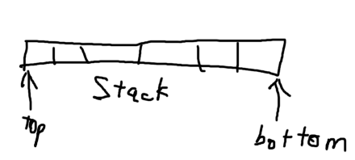

Two Way Stack

The TwoWayStack class is two stacks on a single array. You are only allowed to use arrays and other primitive data types in your implementation. While it is much more effective to use an initial size of 100-1000 for the array size in an implementation of a stack, the value is set to 10 for the sake of testing part (b) below. 

a) Complete the implementation of the TwoWayStack

b) You may realize that the array is of a fixed size; It will run out of space no matter what value you give to sizeOfArray. Therefore, implement a enlargeArray() method that resizes the array when it runs out of space.

You may test your code with TwoWayStackTester.java provided.

