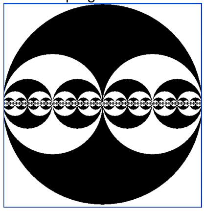

Create a program which will draw the following recursive graphics.

you maybe use the StdDraw class provided to help in drawing.
Credits: Princeton University
Javadocs: http://introcs.cs.princeton.edu/java/stdlib/javadoc/StdDraw.html 