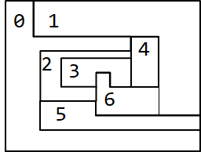

The Four Color Theorem states that any map on a plane can be colored with no more than four colors, so that no two countries with a common border are the same color. Use the backtracking algorithm discussed during lessons to solve the Four Coloring problem given a map. Some partial code has been given to you in FourColor. Complete the code required in okToColor() and explore().

A sample map is given below:



The map above can be represented by the matrix below, where country 0 (map[0]) Is adjacent to 1, 4, 2 and 5 etc:

```
map = new int[7][];
map[0] = new int[] { 1, 4, 2, 5 };
map[1] = new int[] { 0, 4, 6, 5 };
map[2] = new int[] { 0, 4, 3, 6, 5 };
map[3] = new int[] { 2, 4, 6 };
map[4] = new int[] { 0, 1, 6, 3, 2 };
map[5] = new int[] { 2, 6, 1, 0 }; 
map[6] = new int[] { 2, 3, 4, 1, 5 };
```

Sample printed output for above map (note that colouring is NOT unique):
```
true

map[0] is RED
map[1] is YELLOW
map[2] is YELLOW
map[3] is BLUE
map[4] is GREEN
map[5] is GREEN
map[6] is RED
```