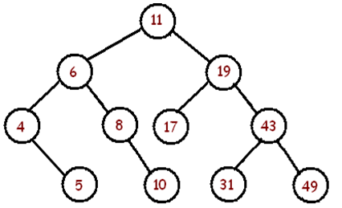

BSTTester.java creates a BST by inserting the following elements in this order:

11, 6, 8, 19, 4, 10, 5, 17, 43, 49, 31

You will get a BST that looks like this:

Complete the in-order, pre-order, post-order and (iterative) level-order traversal methods in the BSTTester.java.

The methods should return ArrayLists containing results of the respective traversals.